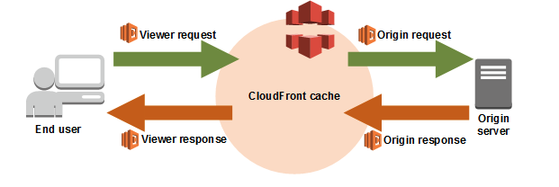
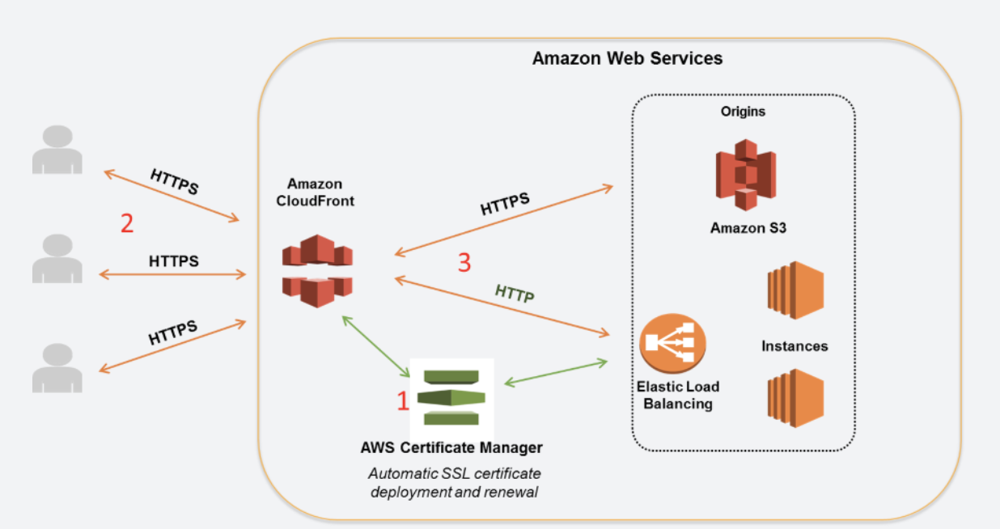

# CloudFront

Allow you to control who can access your content. 

Use **signed URLs** in the following cases:

- You want to use an RTMP distribution. Signed cookies aren't supported for RTMP distributions.
    - How does RTMP streaming work?
        - **Real-Time Messaging Protocol (RTMP)**
        - RTMP is a TCP-based protocol designed to maintain low-latency connections for audio and video streaming. To increase the amount of data that can be smoothly transmitted, streams are split into smaller fragments called packets. ... This means that **video and audio are delivered on separate channels simultaneously**.
- You want to restrict access to individual files, for example, an installation download for your application.

- Your users are using a client (for example, a custom HTTP client) that doesn't support cookies.

Use **signed cookies** in the following cases:

- You want to provide access to multiple restricted files, for example, all of the files for a video in HLS format or all of the files in the subscribers' area of website.

- You don't **want to change your current URLs**.

https://docs.aws.amazon.com/AmazonCloudFront/latest/DeveloperGuide/private-content-choosing-signed-urls-cookies.html    

## Alleviate HTTP 504 for backend

- Lambda@Edge
    - customize the content that CloudFront delivers, e.g. 
     to **execute the authentication process** in AWS locations closer to the users. 
- **set up origin failover with two orgin servers**
    - you can set up an origin failover by creating an origin group with two origins with one as the primary origin and the other as the second origin which CloudFront automatically switches to when the primary origin fails. 

## HTTPs and ACM cetificate

If you got your certificate from a third-party CA, import the certificate into ACM or upload it to the **IAM certificate store**. Hence, AWS Certificate Manager and IAM certificate store are the correct answers.

## use Versions to make sure S3 serve new files in CloudFront

# Global Accelerator
- Leverage the AWS internal network to route to your application
- 2 Anycast IP are created for your application
- The Anycast IP send traffic directly to Edge Locations
- The Edge locations send the traffic to your application

- Works with Elastic IP, EC2 instances, ALB, NLB, public or private

# AWS Global Accelerator vs CloudFront
- They both use the AWS global network and its edge locations around the world
- Both services integrate with AWS Shield for DDoS protection.

CloudFront
- Improves performance for both cacheable content (such as images and videos)
- Dynamiccontent(suchasAPIaccelerationanddynamicsitedelivery) • Content is served at the edge

Global Accelerator
- ImprovesperformanceforawiderangeofapplicationsoverTCPorUDP
- Proxying packets at the edge to applications running in one or more AWS Regions.
- Good fit **for non-HTTP usecases,s**uch as gaming(UDP),IoT(MQTT),or VoiceoverIP
- Good for HTTP use cases that require static IP addresses
- Goodfor HTTP usecases that required deterministic,fast regional failover
