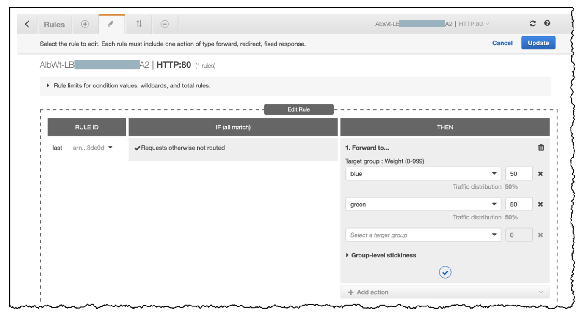

## Basic
- LBs can scale but not instantaneously – contact AWS for a “warm-up”

- Use Security Group to control only LB can access to the application. 
    - do it in The SG of the application

- Troubleshooting
    - 4xx errors are client induced errors
    - 5xx errors are application induced errors
    - Load Balancer Errors 503 means at capacity or no registered target
    - If the LB can’t connect to your application, check your security groups!
- Monitoring
    - ELB access logs will log all access requests (so you can debug per request)
    - CloudWatch Metrics will give you aggregate statistics (ex: connections count)

- LB Stickyness
    - This works for Classic Load Balancers & Application Load Balancers
    - The “cookie” used for stickiness has an expiration date you control
    - Use case: **make sure the user doesn’t lose his session data**
    - Enabling stickiness may bring imbalance to the load over the backend EC2 instances
    

    to be different from Connection Draining, which is in unhealth state.

- Cross-Zone Load Balancing
    - With Cross Zone Load Balancing: each load balancer instance distributes evenly across all registered instances in all AZ
    - Otherwise, each load balancer node distributes requests evenly across the registered instances in its Availability Zone only.

- Load Balancer - SSL Certificates
    - The load balancer uses an X.509 certificate (SSL/TLS server certificate) 
    - manage certificates using ACM (AWS Certificate Manager), or create upload your own certificates alternatively
    - Server Name Indication (SNI)
        - SNI solves the problem of loading multiple SSL certificates onto one web server (to serve multiple websites)
        - It’s a “newer” protocol, and requires the client to indicate the hostname of the target server in the initial SSL handshake
        

    - Notes on SSL/TLS
        - An SSL Certificate allows traffic between your clients and your load balancer to be encrypted in transit (in-flight encryption)
        - SSL refers to Secure Sockets Layer, used to encrypt connections
        - TLS refers toTransport Layer Security,which is a newer version

- Connection Draining
    - **Time to complete “in-flight requests”** while the instance is **de-registering or unhealthy**
    - Between 1 to 3600 seconds, default is 300 seconds
        - Waiting for existing connections to complete
            - DeregistrationDelay (for ALB & NLB)
    
    

## ELB Type

### CLB -classic
- Deprecated

### ALB

- Application load balancers is Layer 7 (HTTP)
    - Support for HTTP/2 and WebSocket
    - Support redirects (from HTTP to HTTPS for example)
    
- Load balancing to multiple HTTP applications across machines ( **multi target groups**)
- Load balancing to multiple applications on the same machine (ex: containers)

- It can route traffic to targets - **EC2 instances**, **containers**, **IP addresses** and **Lambda functions**

- The application servers don’t see the IP of the client directly
    - The true IP of the client is inserted in the header X-Forwarded-For

### NLB

- Network load balancers (Layer 4) allow to: 
    - Forward **TCP & UDP traffic** to your instances
    - Handle millions of request per seconds
    - Less latency ~100 ms (vs 400 ms for ALB)

- NLB has **one static IP per AZ**, and supports assigning Elastic IP (helpful for whitelisting specific IP)

- Use Case:
    - NLB are used for extreme performance,TCP or UDP traffic
    - use-cases involving low latency and high throughput workloads that involve scaling to millions of requests per second

- Not included in the AWS free tier

### Expose URLs

- **Network Load Balancers expose a fixed IP** to the public web, therefore allowing your application to be predictably reached using these IPs, while allowing you to scale your application behind the Network Load Balancer using an ASG.

- **Application and Classic Load Balancers expose a fixed DNS (=URL)** rather than the IP address. So these are incorrect options for the given use-case.

### Server Name Indication (SNI)

 **SNI solves the problem of loading multiple SSL certificates onto one web server** (to serve multiple websites)
 - e.g. domain and subdomain with multi SSL certificates
 
 - how?
    - You can host multiple TLS secured applications, each with its own TLS certificate, behind a single load balancer. In order to use SNI, all you need to do is bind multiple certificates to the same secure listener on your load balancer. ALB will automatically choose the optimal TLS certificate for each client. These features are provided at no additional charge.
    
### Weighted Target Groups Routing   

Application Load Balancers support Weighted Target Groups routing. With this feature, you will be able to do weighted routing of the traffic forwarded by a rule to multiple target groups. This enables various use cases like blue-green, canary and hybrid deployments without the need for multiple load balancers. It even enables zero-downtime migration between on-premises and cloud or between different compute types like EC2 and Lambda.

